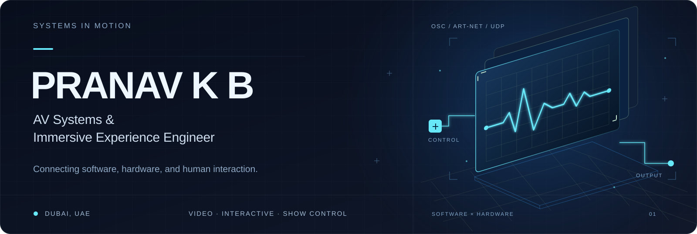

  

  <a href="https://github.com/pranavkb7/PRANAV-BIJITH"><strong>My portfolio</strong></a>
  &nbsp; · &nbsp;
  <a href="https://github.com/pranavkb7/PRANAV-BIJITH/blob/main/projects/README.md">Projects</a>
  &nbsp; · &nbsp;
  <a href="mailto:pranavkbijith@gmail.com">Contact me</a>

## About me

I’m Pranav, an **AV Systems & Immersive Experience Engineer** based in **Dubai, UAE**, with a background in mechatronics.

I work with video, lighting, software, and hardware for live events and interactive installations.

## What I do

- **Video systems:** Set up video playback, LED display mapping, and video switching.
- **Interactive experiences:** Connect sensors and real-time visuals so an installation responds to people.
- **Show control:** Connect playback, lighting, and hardware so they work together.
- **Hardware integration:** Work with microcontrollers, motors, and physical controls.
- **Event applications:** Build practical tools and automate workflows using Python and AI-assisted development.

## Explore my work

**[Open my engineering portfolio →](https://github.com/pranavkb7/PRANAV-BIJITH)**

The portfolio is organized for project descriptions, system diagrams, demos, and code. Project case studies are being prepared and will appear in the [project list](https://github.com/pranavkb7/PRANAV-BIJITH/blob/main/projects/README.md) as they are added.

## Skills & tools

| Area | Tools |
| :--- | :--- |
| Video playback | Disguise · Resolume Arena · Watchout · Ventuz |
| Interactive systems | TouchDesigner · Unreal Engine |
| Video switching | Barco E2 · Analog Way · Blackmagic |
| Lighting | MADRIX · ChamSys · Avolites |
| Programming & hardware | Python · C++ · Arduino · ESP32 · Raspberry Pi |
| Control protocols | OSC · UDP · TCP · DMX · Art-Net |
| Engineering design | SolidWorks · AutoCAD |

## Contact

For AV integration, interactive installations, show control, or collaboration:

**[pranavkbijith@gmail.com](mailto:pranavkbijith@gmail.com)**

